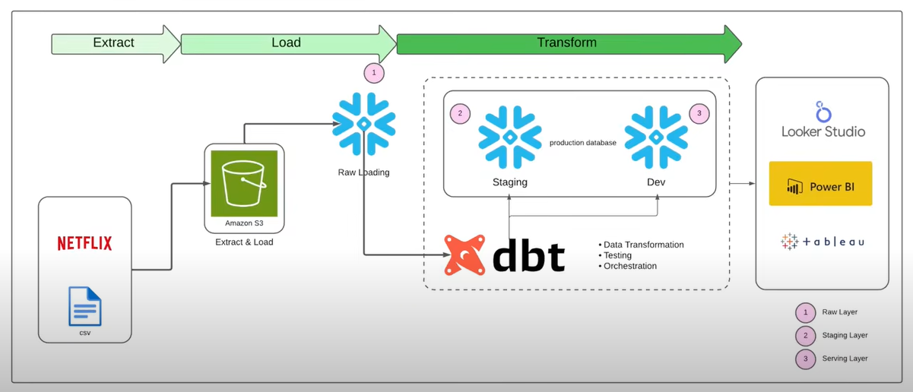

# 🎬 Netflix ELT Data Pipeline with dbt, Snowflake & BI Tools

This project demonstrates a modern **ELT (Extract → Load → Transform)** pipeline for analyzing Netflix data.  
It leverages **Amazon S3, Snowflake, dbt, and BI tools** (Power BI, Tableau, Looker Studio) to transform raw CSV files into analytics-ready datasets and build insightful dashboards.

---

## 📊 Architecture Overview

1. **Extract & Load**
   - Netflix CSV data is ingested and stored in **Amazon S3**.
   - Data is loaded into the **Raw Layer** of Snowflake.

2. **Transform (with dbt)**
   - dbt handles transformations in Snowflake:
     - **Raw Layer** → raw ingestion  
     - **Staging Layer** → cleaned, standardized tables  
     - **Serving Layer** → analytics-ready fact & dimension models  
   - dbt also supports **testing, documentation, and orchestration**.

3. **Visualization**
   - Transformed data is connected to **Power BI, Tableau, and Looker Studio** for building interactive dashboards.
   - Example insights: content availability by region, top genres, trends in ratings, and user activity.

---

## 🛠 Tech Stack

- **Storage & Compute**: Amazon S3, Snowflake  
- **Transformation**: dbt (data build tool)  
- **Orchestration & Testing**: dbt built-in features  
- **Visualization**: Power BI, Tableau, Looker Studio  
- **Language**: SQL, Python (for exploration)

---

## 🚀 Features

- Automated **ELT workflow** using cloud-native tools.  
- Layered architecture: **Raw → Staging → Serving**.  
- **Version-controlled transformations** using dbt.  
- Data quality checks and tests.  
- BI dashboards for actionable insights.  

---

